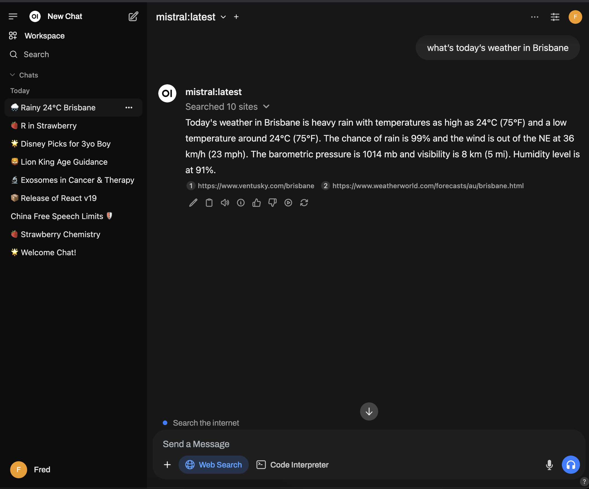

# A Journey to Local RAG

Based on [LangChain framework](https://langchain.com)  
**state-of-the-art**


# Roadmap

✅ - AI Chat App running on local network  
✅ - File upload  
✅ - Web Search  
❌ - Indexing local files  
❌ - RAG Orchestrator

# 0 - Prerequisites installation

- Install [Ollama](https://ollama.com/download)
- Pull [some models](https://ollama.com/library) to mess with

```sh
ollama pull deepseek-r1:14b # reasoning model
ollama pull mistral:latest # general purpose
```

- Install [Docker](https://docs.docker.com/get-started/get-docker/)

# 1 - Setup a UI

Here's a sample of the final result:


## Setup docker

```bash
# Pull the latest image
docker pull ghcr.io/open-webui/open-webui:main

# Volume to persist data
docker volume create open-webui-data

# Run the container
docker run -d -p 6969:8080 \
	-v open-webui-data:/app/backend/data \
	--name open-webui \
	ghcr.io/open-webui/open-webui:main
```

### Health check

```bash
# Check container status
docker ps

# Get your IP
ipconfig getifaddr en0
```

Visit `http://<your_ip>:6969` (or http://localhost:6969) in your browser.

> **Note:**  
> On first run, you will be prompted to create an **admin account**. Other user accounts can be created later on.

## Adjust the settings

### Set system prompt

Go to `Settings` > `General` > `System Prompt` and set it to your liking.

```md
You are the most efficient AI Assistant that answers following these principles:

- Casual, straight-to-the-point responses.
- Prioritise IT best practices and performance.
- Provide trade-offs when applicable.
- Fact-check and provide sources when needed.
```

### Advanced parameters

Go to `Settings` > `Advanced` and set the following parameters:  
_so it knows how many R are in strawberry_

```sh
Mirostat: 0 # no randomness
Top K: 10 # choose within the top 10 tokens
Frequency Penalty: 1 # no recall/repeat
Max tokens (num_predict): 4096 # to be safe
```

### Enable Web Search

> **Note:**  
> We are using Google Search Engine here, but other search engines are available. Full documentation is available [here](https://docs.openwebui.com/tutorials/web-search/google-pse/)

1. Create a [Google Custom Search Engine](https://programmablesearchengine.google.com/controlpanel/create)
2. Grab the `Search Engine ID` created
3. Get the `API Key` from [Custom Search JSON API](https://developers.google.com/custom-search/v1/introduction)

Go to `Settings` > `Admin settings` > `Web Search`  
Set the **Web Search Engine** to be `google_pse` and fill in the `API Key` and `Search Engine ID`.

```sh
Search Result Count: 5
Concurrent Requests: 6
```
